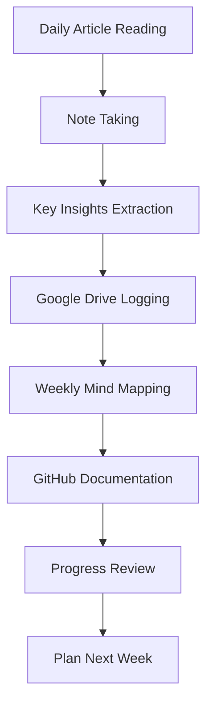
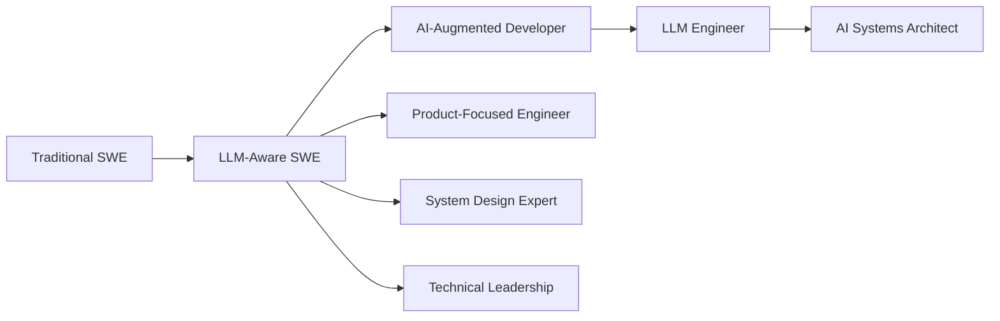

# Software Engineer Upskilling Action Plan in the LLM Era

## Overview

This comprehensive guideline provides Software Engineers (SWEs) with a structured approach to upskilling, continuous learning, and career development in the rapidly evolving landscape of Large Language Models (LLMs) and AI-powered development tools.

## Core Philosophy

**LLMs are tools to augment human capabilities, not replace them.** The future belongs to engineers who master both traditional software engineering principles and AI-powered workflows.

## Daily Learning Framework (30 Minutes Minimum)

### Content Sources & Forums
- **Medium**: Follow AI/ML, LLM, and software engineering publications
- **Reddit Communities**: 
  - r/MachineLearning
  - r/ChatGPTCoding
  - r/developersIndia
  - r/ExperiencedDevs
  - r/artificial
- **Technical Blogs**: Zed, GitHub, OpenAI, Anthropic
- **Academic Sources**: ArXiv papers on software engineering and LLMs
- **Industry Reports**: Stack Overflow Developer Survey, GitHub State of the Octoverse

### Weekly Content Categories
- **Monday**: LLM Architecture & Capabilities
- **Tuesday**: AI Coding Tools & Productivity
- **Wednesday**: Software Engineering Best Practices
- **Thursday**: Career Development & Industry Trends
- **Friday**: Hands-on Tutorials & Code Examples

## Learning Tracking System

### Google Drive Documentation Structure
```
📁 SWE-LLM-Upskilling/
├── 📁 2025/
│   ├── 📁 Week-01/
│   │   ├── 📄 articles-summary.md
│   │   ├── 📄 key-insights.md
│   │   └── 📄 action-items.md
│   └── 📁 Week-XX/
├── 📁 Resources/
│   ├── 📄 tools-and-platforms.md
│   └── 📄 learning-paths.md
└── 📁 Projects/
    └── 📄 hands-on-experiments.md
```

### Article Logging Template
```markdown
## Article: [Title]
**Source**: [URL]
**Date**: [YYYY-MM-DD]
**Reading Time**: [X minutes]

### Key Takeaways
- Point 1
- Point 2
- Point 3

### Actionable Insights
- [ ] Action 1
- [ ] Action 2

### Related Topics to Explore
- Topic 1
- Topic 2

### Personal Rating: X/5
**Reason**: [Brief explanation]
```

## Mind Mapping with NotebookLM

### Weekly Mind Map Creation Process
1. **Input Preparation**: Collect all weekly articles and summaries
2. **Upload to NotebookLM**: Batch upload documents
3. **Generate Study Guide**: Use NotebookLM to create comprehensive study guides
4. **Create Audio Overview**: Generate podcast-style summaries for mobile learning
5. **Extract Key Concepts**: Identify main themes and connections

### Mind Map Categories
- **Technical Concepts**: LLM architectures, coding tools, frameworks
- **Career Impact**: Job market trends, skill requirements, salary implications
- **Best Practices**: Code quality, testing, deployment strategies
- **Future Trends**: Emerging technologies, industry predictions

## Weekly GitHub Documentation

### Repository Structure
```
📁 swe-llm-learning/
├── 📁 week-01/
│   ├── 📄 README.md
│   ├── 📄 articles.md
│   ├── 📄 flowchart.md (Mermaid)
│   └── 📄 experiments.md
├── 📁 resources/
│   ├── 📄 tools-comparison.md
│   └── 📄 learning-roadmap.md
└── 📄 progress-tracker.md
```

### Mermaid Flowchart Templates

#### Learning Process Flow


#### Career Development Path


## Core Skill Development Areas

### 1. LLM Integration Skills
- **Prompt Engineering**: Crafting effective prompts for code generation
- **Context Management**: Managing large codebases with LLM assistance
- **Quality Assurance**: Validating LLM-generated code
- **Tool Mastery**: GitHub Copilot, Cursor, Claude, ChatGPT

### 2. Enhanced Software Engineering
- **System Design**: Architecture patterns for LLM-integrated applications
- **Testing Strategies**: Testing LLM-assisted development workflows
- **Code Review**: Reviewing both human and AI-generated code
- **Documentation**: Creating clear specs for AI assistance

### 3. AI/ML Fundamentals
- **Model Understanding**: How LLMs work at a high level
- **Fine-tuning**: Customizing models for specific domains
- **Deployment**: Serving LLM applications at scale
- **Evaluation**: Measuring LLM performance in software contexts

### 4. Emerging Technologies
- **Multi-Agent Systems**: Orchestrating multiple AI agents
- **RAG Systems**: Retrieval-Augmented Generation for code assistance
- **Vector Databases**: Storing and retrieving code embeddings
- **MLOps**: Managing AI model lifecycles

## Progress Measurement Framework

### Monthly Assessments

#### Technical Skills (1-5 Scale)
- [ ] LLM Tool Proficiency
- [ ] Prompt Engineering
- [ ] System Design
- [ ] Code Quality with AI
- [ ] Testing & Debugging
- [ ] Performance Optimization

#### Productivity Metrics
- [ ] Code completion speed
- [ ] Bug resolution time
- [ ] Feature delivery velocity
- [ ] Learning retention rate
- [ ] Tool adoption success

### Quarterly Reviews

#### Career Development Goals
- [ ] New skills acquired
- [ ] Projects completed
- [ ] Industry knowledge gained
- [ ] Network expansion
- [ ] Certification progress

#### Market Positioning
- [ ] Resume updates
- [ ] Portfolio enhancements
- [ ] LinkedIn profile optimization
- [ ] Technical blog contributions
- [ ] Open source contributions

## Fine-Tuning Strategies

### Continuous Improvement Loop

#### Weekly Reviews
1. **Effectiveness Assessment**: What worked well this week?
2. **Challenge Identification**: What obstacles were encountered?
3. **Strategy Adjustment**: How can the approach be improved?
4. **Goal Refinement**: Are the learning objectives still relevant?

#### Monthly Deep Dives
1. **Skill Gap Analysis**: Compare current abilities with market demands
2. **Tool Evaluation**: Assess new tools and technologies
3. **Career Path Validation**: Ensure alignment with industry trends
4. **Learning Method Optimization**: Refine study techniques

### Adaptation Triggers
- **New Tool Release**: Major AI coding tool updates
- **Industry Shifts**: Significant changes in job requirements
- **Personal Bottlenecks**: Learning plateau identification
- **Market Feedback**: Interview experiences and feedback

## Action Items & Implementation

### Week 1-2: Foundation Setup
- [ ] Create Google Drive folder structure
- [ ] Set up GitHub repository
- [ ] Install and configure NotebookLM
- [ ] Establish daily reading routine
- [ ] Complete first week of article logging

### Week 3-4: Tool Integration
- [ ] Set up AI coding tools (Copilot, Cursor, etc.)
- [ ] Practice prompt engineering techniques
- [ ] Create first mind map with NotebookLM
- [ ] Document first flowchart with Mermaid

### Month 2: Skill Development
- [ ] Complete online course on LLM fundamentals
- [ ] Build first AI-assisted project
- [ ] Contribute to open source with AI tools
- [ ] Conduct first monthly assessment

### Month 3: Optimization
- [ ] Refine learning process based on feedback
- [ ] Expand network through tech communities
- [ ] Apply for roles requiring AI skills
- [ ] Plan next quarter's learning objectives

## Success Indicators

### Short-term (3 months)
- Consistent daily learning habit established
- Proficient with major AI coding tools
- Improved code delivery speed by 25%
- Active participation in tech communities

### Medium-term (6 months)
- Completed 2-3 AI-assisted projects
- Contributed to open source projects
- Built professional network in AI/LLM space
- Received positive feedback on AI tool usage

### Long-term (12 months)
- Advanced to senior role or specialized AI position
- Recognized as AI-aware engineer in organization
- Mentoring others in AI tool adoption
- Contributing thought leadership content

## Risk Mitigation

### Common Pitfalls to Avoid
1. **Over-reliance on AI**: Maintain core programming fundamentals
2. **Tool Obsession**: Focus on principles over specific tools
3. **Isolation**: Stay connected with human developers and mentors
4. **Skill Tunnel Vision**: Balance AI skills with traditional engineering
5. **Burnout**: Maintain sustainable learning pace

### Backup Strategies
- **Market Downturn**: Focus on efficiency and automation skills
- **AI Regulation**: Develop compliance and ethical AI practices
- **Tool Obsolescence**: Build transferable skills across platforms
- **Career Stagnation**: Pivot to adjacent roles (DevOps, QA, PM)

## Conclusion

The LLM era presents unprecedented opportunities for software engineers who proactively adapt and upskill. By following this structured approach to learning, documentation, and skill development, engineers can position themselves at the forefront of this technological revolution while maintaining their core value as problem solvers and system builders.

Remember: **The goal is not to compete with AI, but to collaborate with it effectively.**

---

*This document is a living guide that should be updated regularly based on industry developments and personal learning experiences.*